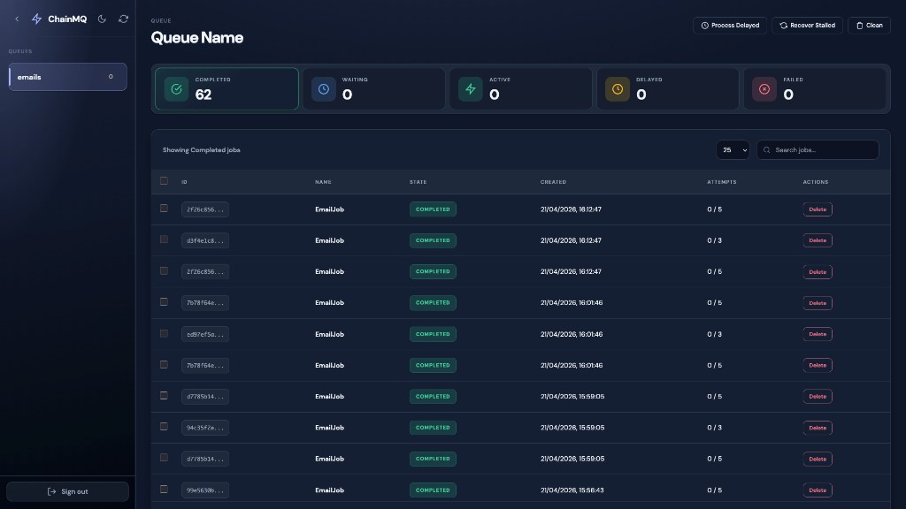
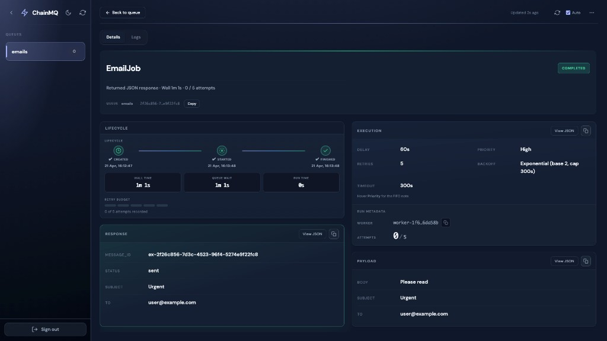
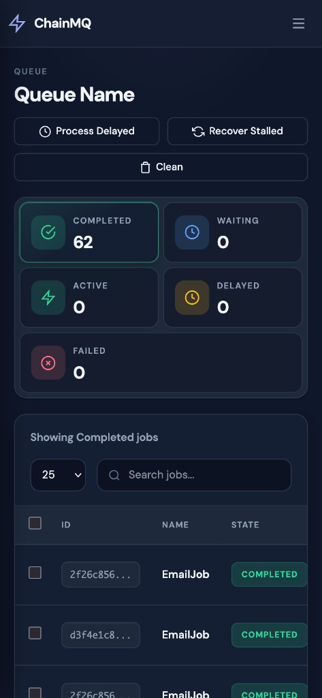
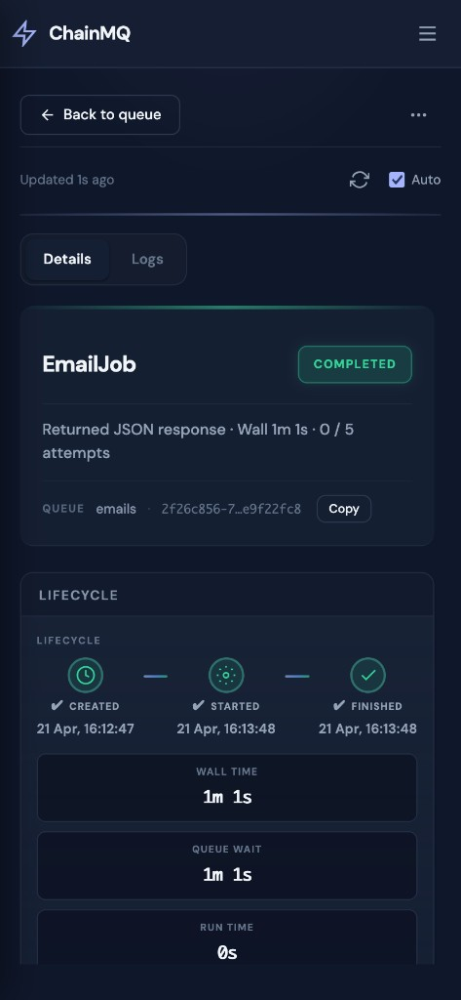

#  ChainMQ

A Redis-backed, type-safe job queue for Rust. Provides job registration and execution, delayed jobs, retries with backoff, and scalable workers.

This crate is library-first. Runnable examples demonstrate typical patterns (single worker, multiple jobs, multiple workers, delayed jobs, failure/retry).

## Features

- 🚀 Redis-Powered: Built on Redis for reliable job persistence and distribution
- 🔄 Background Jobs: Process jobs asynchronously in the background
- 🏗️ Job Registry: Simple Type-safe job registration and execution
- 🔧 Worker Management: Configurable workers with lifecycle management
- ⚡ Async/Await: Full async support throughout the system
- ⏰ Delayed jobs: Schedule jobs for future execution with atomic operations
- 🗄️ Backoff strategies: Configurable retry logic for failed jobs
- 📊 Application Context: Share application state across jobs
- 🖥️ Web UI: Dashboard for monitoring and managing queues (one server sees every logical queue under the same Redis `key_prefix`; see [README_UI.md](./README_UI.md))
- 📜 Queue lifecycle events (Redis Stream + pub/sub) and dashboard **Activity** + **Redis** modal (`INFO` snapshot; documented in README_UI.md)
- 📝 Optional Redis-backed job log lines when the worker opts in to `tracing_job_logs` and the job-log layer (README_UI.md)

### Web dashboard (responsive)

The dashboard adapts from wide layouts (sidebar + dense tables) to narrow viewports (mobile chrome, off-canvas queue menu, stacked controls and cards). Setup and options are in [README_UI.md](./README_UI.md).

|                                        Desktop — queue                                         |                                      Desktop — job detail                                       |
| :--------------------------------------------------------------------------------------------: | :---------------------------------------------------------------------------------------------: |
|  |  |

|                                       Mobile — queue                                        |                                       Mobile — job detail                                        |
| :-----------------------------------------------------------------------------------------: | :----------------------------------------------------------------------------------------------: |
|  |  |

## Quick Start

Add ChainMQ to your `Cargo.toml`:

```toml
[dependencies]
chainmq = "1.3.1"
tokio = { version = "1", features = ["full"] }
serde = { version = "1.0", features = ["derive"] }
async-trait = "0.1"
```

The crate enables the **`web-ui`** feature by default (Axum dashboard router you nest on your server). For a smaller dependency tree, use `chainmq = { version = "1.1.2", default-features = false }`. Add `features = ["web-ui"]` or `["web-ui-axum"]` / `["web-ui-actix"]` when you want the dashboard. See [README_UI.md](./README_UI.md) for setup, log capture, and [`WebUIMountConfig`](./README_UI.md#webuimountconfig).

## Basic Usage:

### 1. Define Your Job

```rust
use chainmq::{AppContext, Job, JobContext};
use serde::{Deserialize, Serialize};
use async_trait::async_trait;
use std::sync::Arc;

#[derive(Debug, Clone, Serialize, Deserialize)]
pub struct EmailJob {
    pub to: String,
    pub subject: String,
    pub body: String,
}

#[async_trait]
impl Job for EmailJob {
    async fn perform(&self, ctx: &JobContext) -> chainmq::Result<()> {
        if let Some(app_ctx) = ctx.app::<AppState>() {
            let response = app_ctx
                .mail_client
                .send_email(&self.to, &self.subject, &self.body)
                .await;

            match response {
                Ok(result) => println!("Email sent successfully: {:#?}", result),
                Err(error) => println!("Failed to send email: {}", error),
            }
        }

        Ok(())
    }

    fn name() -> &'static str {
        "EmailJob"
    }

    fn queue_name() -> &'static str {
        "emails"
    }
}
```

### 2. Set Up Application Context

```rust
use chainmq::AppContext;
use std::sync::Arc;

#[derive(Clone)]
pub struct AppState {
    pub mail_client: Arc<MailClient>,
    pub redis_client: Arc<redis::Client>,
}

impl AppContext for AppState {
    fn clone_context(&self) -> Arc<dyn AppContext> {
        Arc::new(self.clone())
    }
}
```

### 3. Configure workers and mount the dashboard (Axum)

```rust
use std::{net::SocketAddr, sync::Arc};

use axum::Router;
use chainmq::{
    chainmq_dashboard_router, JobRegistry, Queue, QueueOptions, RedisClient, WebUIMountConfig,
    WorkerBuilder,
};
use redis::Client;

async fn setup_application() -> Result<(), anyhow::Error> {
    let redis_client = Client::open("redis://127.0.0.1/")?;

    let app_state = Arc::new(AppState {
        mail_client: Arc::new(MailClient::new()),
        redis_client: Arc::new(redis_client.clone()),
    });

    let mut registry = JobRegistry::new();
    registry.register::<EmailJob>();

    let app_state_for_worker = app_state.clone();
    tokio::spawn(async move {
        let mut worker = WorkerBuilder::new_with_redis_instance(
            app_state_for_worker.redis_client.as_ref(),
            registry,
        )
        .with_app_context(app_state_for_worker.clone())
        .with_queue_name(EmailJob::queue_name())
        .spawn()
        .await
        .expect("Failed to initialize workers");

        let _ = worker.start().await;
    });

    let queue = Queue::new(QueueOptions {
        redis: RedisClient::Client(redis_client),
        ..Default::default()
    })
    .await?;

    let dashboard = chainmq_dashboard_router(
        queue,
        WebUIMountConfig {
            ui_path: "/queues".to_string(),
            ..Default::default()
        },
    )?;

    let app = Router::new()
        .nest("/queues", dashboard)
        .route("/api/health", axum::routing::get(|| async { "ok" }));

    let addr = SocketAddr::from(([127, 0, 0, 1], 8000));
    let listener = tokio::net::TcpListener::bind(addr).await?;
    axum::serve(listener, app).await?;

    Ok(())
}
```

### 4. Enqueue Jobs from Anywhere

```rust
use chainmq::{Queue, QueueOptions, RedisClient};

async fn enqueue_email_job(app_state: &AppState) -> chainmq::Result<()> {
    let email_job = EmailJob {
        to: "user@example.com".to_string(),
        subject: "Welcome!".to_string(),
        body: "Thank you for signing up!".to_string(),
    };

    let options = QueueOptions {
        redis: RedisClient::Client(app_state.redis_client.as_ref().clone()),
        ..Default::default()
    };

    let queue = Queue::new(options).await?;

    // Enqueue the job
    match queue.enqueue(email_job).await {
        Ok(_) => println!("Email job enqueued successfully"),
        Err(error) => eprintln!("Failed to enqueue email job: {}", error),
    }

    Ok(())
}
```

## Examples

Runnable examples live under `examples/`. Build them all:

```bash
cargo build --examples
```

Run Redis first, then use separate terminals for workers and enqueuers:

```bash
# Single worker for the emails queue (enables tracing → Redis job logs like the web UI example)
cargo run --example worker_main

# Enqueue email jobs (normal + delayed / high priority); optional UI entrypoint at end of file
cargo run --example enqueue_email

# One worker handling multiple job types on one logical queue name
cargo run --example multi_jobs_single_worker

# Multiple job types each with their own queue_name(); enqueue then start UI (same Redis)
cargo run --example multi_jobs_with_ui

# Two workers polling different logical queues (emails + reports)
cargo run --example multi_workers

# Failure and retry with backoff
cargo run --example failure_retry

# Delayed jobs
cargo run --example delayed_jobs

# Axum host + nested dashboard — see README_UI.md
cargo run --example start_ui
# Then open http://127.0.0.1:8080/dashboard/ (see example source for path and port)

# Larger enqueue/processing demo (data volume / stress-style usage)
cargo run --example large_data_processing

# Minimal Axum binary + dashboard (`REDIS_URL` optional)
cargo run --example web_ui
```

**Notes:**

- You can enqueue before or after workers start. Jobs persist in Redis until claimed.
- Workers must use `.with_queue_name()` that matches the jobs they should claim; use the **same Redis endpoint (or equivalent `RedisClient` setting) and `key_prefix`** as producers and the web UI so everyone sees the same data.
- Some examples use non-default Redis URLs or ports (for example `6370`). Check the top of each example and adjust for your environment.

## Core Concepts

- **Job**: Defines work to be done. Implements `trait Job { async fn perform(&self, &JobContext) -> Result<()>; fn name() -> &str; fn queue_name() -> &str }`
- **Queue**: One client handle for a Redis instance and `key_prefix`. It persists job metadata and manages wait / delayed / active / failed lists. **Logical queues** are the string returned by `Job::queue_name()`; many names can coexist under one `Queue`. Listing and the web UI operate on every queue name in that namespace.
- **Worker**: Polls a configured queue name, claims jobs atomically via Lua scripts, and executes them through `JobRegistry`
- **Registry**: Maps job type names to executors for deserialization and dispatch
- **JobContext**: Application state (`AppContext`), job metadata, the same `Arc<Queue>` the worker uses (`queue()`), optional progress updates, and a cooperative `CancellationToken`

**Web UI:** Mount [`chainmq_dashboard_router`](https://docs.rs/chainmq/latest/chainmq/fn.chainmq_dashboard_router.html) (or the Actix [`configure_chainmq_web_ui`](https://docs.rs/chainmq/latest/chainmq/fn.configure_chainmq_web_ui.html) helper) with **one** [`Queue`](https://docs.rs/chainmq/latest/chainmq/struct.Queue.html) for the same Redis + `key_prefix` as workers; it discovers **all** logical queue names in that namespace. Details: [README_UI.md](./README_UI.md).

## Configuration

### Redis Configuration

ChainMQ targets the **`redis` 1.x** crate and uses [`redis::aio::ConnectionManager`](https://docs.rs/redis/latest/redis/aio/struct.ConnectionManager.html) internally for queues (automatic reconnect with bounded connect and response timeouts when built from a URL or `redis::Client`).

You describe how to reach Redis on `QueueOptions` via the `RedisClient` enum (exported at the crate root as `chainmq::RedisClient`):

- **`RedisClient::Url(String)`** — open a client and build a connection manager from the URL (default in `QueueOptions::default`).
- **`RedisClient::Client(redis::Client)`** — share an existing synchronous client (for example the same one you keep in application state).
- **`RedisClient::Manager(ConnectionManager)`** — reuse an already-built manager (for example one you created for custom tuning, or to share one manager across several components).

```rust
use chainmq::{QueueOptions, RedisClient};

// URL only (typical for scripts and examples)
let _ = QueueOptions {
    redis: RedisClient::Url("redis://127.0.0.1:6379".into()),
    ..Default::default()
};

// Existing redis::Client
let redis_client = redis::Client::open("redis://127.0.0.1:6379/")?;
let _ = QueueOptions {
    redis: RedisClient::Client(redis_client.clone()),
    ..Default::default()
};

// With authentication or DB index in the URL
let _ = QueueOptions {
    redis: RedisClient::Url("redis://:password@127.0.0.1:6379/0".into()),
    ..Default::default()
};
```

### Worker Configuration

```rust
use chainmq::WorkerBuilder;
use redis::aio::ConnectionManager;

// Using an existing redis::Client (takes a reference; clones internally for options)
let worker = WorkerBuilder::new_with_redis_instance(&redis_client, registry)
    .with_app_context(app_state)
    .with_queue_name("priority_queue")
    .with_concurrency(10)                           // Number of concurrent jobs
    .with_poll_interval(Duration::from_secs(5))     // How often to check for jobs
    .spawn()
    .await?;

// Using Redis URI (stored as RedisClient::Url on the worker's QueueOptions)
let worker = WorkerBuilder::new_with_redis_uri("redis://127.0.0.1:6379/", registry)
    .with_app_context(app_state)
    .with_queue_name("background_tasks")
    .with_concurrency(5)
    .spawn()
    .await?;

// Optional: reuse a ConnectionManager you built yourself
let worker = WorkerBuilder::new_with_redis_manager(manager, registry)
    .with_queue_name("shared_manager_queue")
    .spawn()
    .await?;
```

### Queue Configuration

```rust
use chainmq::{Queue, QueueOptions, RedisClient};

let options = QueueOptions {
    name: "default".to_string(),
    redis: RedisClient::Url("redis://127.0.0.1:6379".into()),
    key_prefix: "rbq".to_string(),
    default_concurrency: 10,
    max_stalled_interval: 30000, // 30 seconds
    job_logs_max_lines: 500,
};

let queue = Queue::new(options).await?;
```

### Job Configuration

```rust
let job = EmailJob {
    to: "user@example.com".into(),
    subject: "Urgent".into(),
    body: "Please read".into(),
};

let opts = JobOptions {
    delay_secs: Some(60),
    priority: Priority::High, // stored for forward compatibility; FIFO queue does not reorder by priority yet
    attempts: 5,
    backoff: BackoffStrategy::Exponential { base: 2, cap: 10 },
    timeout_secs: Some(60),
    rate_limit_key: None, // reserved for future use — not enforced by the worker
};

let job_id = queue.enqueue_with_options(job, opts).await?;
```

> **Note:** `priority` and `rate_limit_key` are persisted on job metadata but **not yet enforced** by ChainMQ (the wait queue is FIFO). Use application-level logic if you need strict prioritization or rate limits today.

## Advanced Usage

### Service Injection with AppContext

Inject your own services (database pools, HTTP clients, caches, etc.) via `AppContext`. The worker holds an `Arc<dyn AppContext>` and each job receives it through `JobContext`.

```rust
use chainmq::AppContext;
use std::sync::Arc;

#[derive(Clone)]
struct AppState {
    pub database: sqlx::PgPool,
    pub http_client: reqwest::Client,
    pub cache: Arc<RedisCache>,
    pub mail_client: Arc<MailClient>,
}

impl AppContext for AppState {
    fn clone_context(&self) -> Arc<dyn AppContext> {
        Arc::new(self.clone())
    }
}
```

Use it inside jobs via the helper `ctx.app::<T>()`:

```rust
#[async_trait]
impl Job for DatabaseJob {
    async fn perform(&self, ctx: &JobContext) -> chainmq::Result<()> {
        if let Some(app) = ctx.app::<AppState>() {
            // Use database
            let user = sqlx::query_as!(User, "SELECT * FROM users WHERE id = $1", self.user_id)
                .fetch_one(&app.database)
                .await?;

            // Use HTTP client
            let response = app.http_client
                .get("https://api.example.com/data")
                .send()
                .await?;

            // Use cache
            app.cache.set(&format!("user:{}", user.id), &user).await?;
        }

        Ok(())
    }

    fn name() -> &'static str { "DatabaseJob" }
    fn queue_name() -> &'static str { "database" }
}
```

### Multiple Job Types

Register multiple job types in a single registry:

```rust
let mut registry = JobRegistry::new();
registry.register::<EmailJob>();
registry.register::<ImageProcessingJob>();
registry.register::<ReportGenerationJob>();
registry.register::<CleanupJob>();

// Single worker can handle all job types
let worker = WorkerBuilder::new_with_redis_instance(&redis_client, registry)
    .with_queue_name("mixed_jobs")
    .spawn()
    .await?;
```

### Delayed Jobs

Schedule jobs for future execution:

```rust
use chainmq::JobOptions;
use std::time::Duration;

let delayed_job = EmailJob {
    to: "user@example.com".to_string(),
    subject: "Reminder".to_string(),
    body: "Don't forget about your appointment!".to_string(),
};

let options = JobOptions {
    delay_secs: Some(3600), // 1 hour delay
    ..Default::default()
};

queue.enqueue_with_options(delayed_job, options).await?;
```

### Error Handling and Retries

Jobs that fail are automatically retried with configurable backoff:

```rust
#[async_trait]
impl Job for RiskyJob {
    async fn perform(&self, ctx: &JobContext) -> chainmq::Result<()> {
        // This job might fail and will be retried
        if random::<f32>() < 0.3 {
            return Err("Random failure".into());
        }

        println!("Job succeeded!");
        Ok(())
    }

    fn name() -> &'static str { "RiskyJob" }
    fn queue_name() -> &'static str { "risky" }
}
```

## Internals (high level)

Each `Queue` holds a clone-friendly Redis async [`ConnectionManager`](https://docs.rs/redis/latest/redis/aio/struct.ConnectionManager.html) (built from your `RedisClient` choice) for commands and script evaluation.

ChainMQ uses Lua scripts to ensure atomic operations:

- **`move_delayed.lua`**: Moves due jobs from delayed sorted set to wait list
- **`claim_job.lua`**: Atomically pops from wait list and adds to active list

Redis keys use a configurable prefix (default `rbq`):

- `rbq:queues` - Set of logical queue names (also discovered by scanning queue key patterns)
- `rbq:queue:{name}:wait` - Jobs waiting to be processed
- `rbq:queue:{name}:active` - Jobs currently being processed
- `rbq:queue:{name}:delayed` - Jobs scheduled for future execution
- `rbq:queue:{name}:failed` - Jobs that have failed processing
- `rbq:queue:{name}:completed` - Completed job IDs (when used)
- `rbq:job:{id}` - Individual job metadata and payload
- `rbq:job:{id}:logs` - Per-job log lines for the UI (when enabled)

## Troubleshooting

**Jobs not being processed:**

- Ensure worker `.with_queue_name()` matches `Job::queue_name()`
- Verify the same Redis endpoint and `RedisClient` mode (URL vs shared client vs manager) for both worker and enqueuer, not only the host string
- Check jobs are enqueued: `redis-cli LRANGE rbq:queue:{queue}:wait 0 -1`

**Connection issues:**

- Verify Redis server is running and accessible
- Check Redis URL format and credentials
- Test connection with `redis-cli ping`

**Jobs failing silently:**

- Check Redis logs and failed job queue: `LRANGE rbq:queue:{queue}:failed 0 -1`
- Add logging/tracing to your job implementations
- Ensure job payload can be properly serialized/deserialized

**Performance issues:**

- Increase worker concurrency with `.with_concurrency(n)`
- Reduce poll interval with `.with_poll_interval(duration)`
- Monitor Redis memory usage and job queue lengths

## Development

```bash
# Build the library
cargo build

# Run examples (requires Redis)
cargo run --example worker_main
```

## License

MIT

## Acknowledgements

Inspired by existing Redis-backed job queues; built for ergonomic, type-safe Rust applications.
